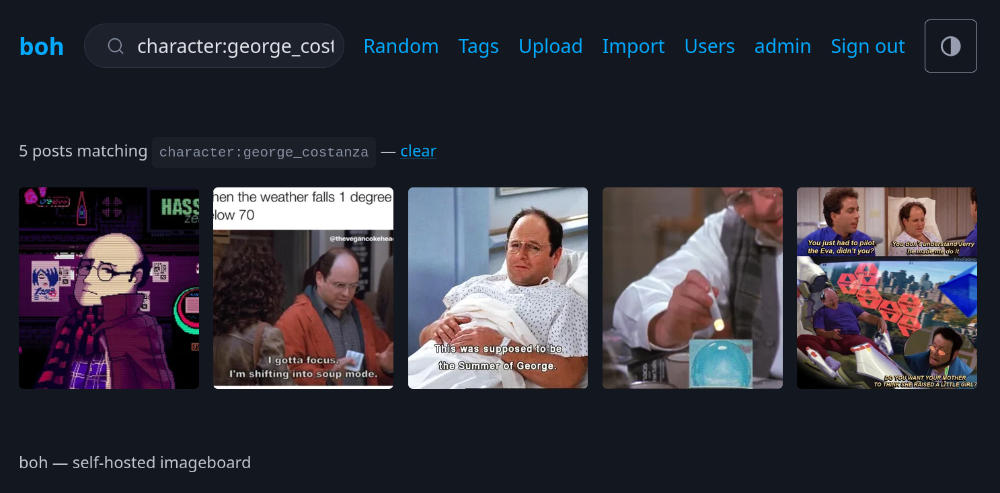

# boh

A self-hosted imageboard for one person or a few friends. Tag-based, deliberately small,
and designed to run as a single container with a single volumes. 

Think danbooru, minus everything needed to serve thousands of strangers. It should be simple enough for selfhosters to deploy. Contributions are welcome. That said, I want to keep this application relatively simple and lightweight.



## Features

- Upload images and video; thumbnails generated automatically
- Namespaced tags (`artist:foo`, `meme:pondering_my_orb`, `rating:safe`) with autocomplete
- Tag search with exclusion (`landscape -rating:explicit`)
- Tag **aliases** — `scenery` can redirect to `landscape` everywhere
- Tag **implications** — `meme:pondering_my_orb` can automatically apply `format:reaction_image`
- Import from third-party sites via bundled [gallery-dl](https://github.com/mikf/gallery-dl),
  mapping site metadata onto tags
- Duplicate detection: the same file cannot be posted twice
- Thumbnails rebuildable from originals, so they can live on disposable storage
- Light/dark/auto theming, mobile-first layout
- Optional public browsing with private writes
- Multi-user: ordinary accounts plus administrators who manage them

## Quick start

```yaml
# docker-compose.yml
services:
  boh:
    image: ghcr.io/kylebavis/boh:latest
    ports:
      - "8080:8080"
    volumes:
      - boh_data:/data
    environment:
      BOH_ADMIN_PASSWORD: change-me
    restart: unless-stopped

volumes:
  boh_data:
```

```sh
docker compose up -d
```

Open <http://localhost:8080> and sign in as **`admin`** with the password you set.

Everything lives under `/data` — database, originals, thumbnails. Back up that one
directory and you have backed up the whole instance.

## Configuration

All settings are environment variables.

| Variable | Default | Meaning |
|---|---|---|
| `BOH_ADMIN_PASSWORD` | — | Password for the seeded `admin` account. Reapplied on every start, along with its administrator rights. |
| `BOH_AUTH_MODE` | `single` | `single` for password auth, `none` to disable auth entirely. |
| `BOH_PUBLIC_READ` | `false` | When `true`, anyone can browse and view; uploading, tagging, deleting and importing still require signing in. |
| `BOH_DATA_PATH` | `/data` | Base directory. Everything below defaults to a subdirectory of this. |
| `BOH_DB_PATH` | `{DATA}/boh.db` | SQLite database file. **Must be local storage** — see below. |
| `BOH_ORIGINALS_PATH` | `{DATA}/originals` | Full-size media. The bulk of the data; the usual candidate for a NAS. |
| `BOH_THUMBS_PATH` | `{DATA}/thumbs` | Generated thumbnails. Regenerable, but only by re-processing every original. |
| `BOH_KEYS_PATH` | `{DATA}/keys` | Data protection keys. Keep with the database. |
| `BOH_TEMP_PATH` | `{DATA}/tmp` | Scratch space for imports. |
| `BOH_MAX_UPLOAD_MB` | `256` | Largest accepted upload. |
| `BOH_PAGE_SIZE` | `40` | Posts per gallery page. |
| `BOH_THUMBNAIL_SIZE` | `400` | Longest thumbnail edge, in pixels. |
| `BOH_IMPORT_MAX` | `50` | Most files a single gallery-dl import may produce. |
| `BOH_IMPORT_TIMEOUT_SEC` | `300` | How long an import may run before it is stopped. |
| `ASPNETCORE_URLS` | `http://+:8080` | Listen address. |

### Storage layout

By default everything lives under `/data` and one volume is all you need. The three kinds
of state can also be split across different storage, which is worth doing once the archive
outgrows local disk:

| What | Grows | Notes |
|---|---|---|
| Database | Slowly | Small, but written constantly. **Local disk only.** |
| Originals | Fast | The reason to reach for a NAS. Written once, read occasionally. |
| Thumbnails | With the archive | ~1–2% of originals. Fast storage helps, since a gallery page reads dozens at once. |

> **Do not put the database on a network share.** SQLite depends on POSIX advisory locks
> behaving correctly, which SMB/CIFS and NFS do not reliably provide, and WAL mode needs
> shared memory they cannot offer at all. The failure mode is silent corruption rather than
> a clean error. boh checks the filesystem backing the database at startup and logs a
> warning if it looks network-backed, but it will not stop you.

A split deployment — database on local disk, media on a NAS, thumbnails local for speed:

```yaml
services:
  boh:
    image: ghcr.io/kylebavis/boh:latest
    ports:
      - "8080:8080"
    volumes:
      - /var/lib/boh:/var/lib/boh          # database + keys, local disk
      - /mnt/nas/booru:/mnt/media          # originals, SMB mount
      - boh_thumbs:/var/cache/boh-thumbs   # thumbnails, local
    environment:
      BOH_ADMIN_PASSWORD: change-me
      BOH_DB_PATH: /var/lib/boh/boh.db
      BOH_KEYS_PATH: /var/lib/boh/keys
      BOH_TEMP_PATH: /var/lib/boh/tmp
      BOH_ORIGINALS_PATH: /mnt/media
      BOH_THUMBS_PATH: /var/cache/boh-thumbs
    restart: unless-stopped

volumes:
  boh_thumbs:
```

**Permissions are the thing that will bite you.** The container runs as **uid 1654**, and a
new Docker volume or host directory is created owned by root, so the app cannot write to it.
Prepare each location first:

```sh
sudo mkdir -p /var/lib/boh
sudo chown -R 1654:1654 /var/lib/boh
```

For an SMB mount, set the owner at mount time rather than with `chown` — in `/etc/fstab`:

```
//nas/booru  /mnt/nas/booru  cifs  credentials=/etc/boh-smb,uid=1654,gid=1654,nofail  0  0
```

boh checks every configured location is writable before it starts, and names the offending
path and the exact `chown` to run if not.

**Notes on splitting**

- Upload staging always lives inside `BOH_ORIGINALS_PATH`, so committing a file is a rename
  within one filesystem rather than a copy across two. It is not separately configurable for
  that reason.
- Originals are content-addressed, so the tree can be moved between hosts or storage as-is —
  paths depend only on the file's SHA-256, never on the database.
- Thumbnails are derived data and can be rebuilt from the originals — **Maintenance →
  Regenerate missing thumbnails**. That makes the thumbnail directory the one location safe
  to drop or move without a backup, at the cost of re-reading every original to rebuild it.
- Back up the database and originals. Losing the database loses all tags; the originals
  themselves are self-describing (their filename is their SHA-256).

### Users and roles

`BOH_ADMIN_PASSWORD` seeds an account called **`admin`**, which is always an administrator.
From **Users** in the nav, an administrator can add accounts, reset passwords, promote and
demote, and remove people. Anyone signed in can change their own password from **Account**.

| | User | Administrator |
|---|---|---|
| Browse and search | ✓ | ✓ |
| Upload, tag, delete posts | ✓ | ✓ |
| Import from a URL | ✓ | ✓ |
| Change own password | ✓ | ✓ |
| Manage users | | ✓ |
| Aliases, implications, namespace colours | | ✓ |
| Maintenance (rebuild thumbnails, delete unused tags) | | ✓ |

The split is between *using* the collection and *reconfiguring it for everyone*. A tag alias
or implication silently rewrites what every other user sees, so those sit with administrators
alongside user management.

A few behaviours worth knowing:

- **Changes apply immediately.** Deleting someone signs them out on their next request rather
  than whenever their cookie expires, and promoting or demoting takes effect without asking
  them to sign in again.
- **The last administrator cannot be deleted or demoted**, and you cannot delete the account
  you are currently signed in with — either would leave the instance unmanageable from inside.
- **Deleting a user keeps their posts.** The uploader field is cleared; nothing in the
  collection is removed.
- **The seeded `admin` account is reapplied on every start** while `BOH_ADMIN_PASSWORD` is set —
  including its administrator rights. That makes it the way back in if you lock yourself out,
  but it also means deleting or demoting it does not stick. Unset the variable once you have
  another administrator if you would rather manage accounts entirely from the UI.
- `BOH_AUTH_MODE=none` removes accounts altogether, and with them the distinction — everyone
  reaching the port gets administrator capabilities.

### Security notes

Read these before exposing boh to anything.

- **boh speaks plain HTTP.** Put it behind a reverse proxy that terminates TLS. It honours
  `X-Forwarded-For` and `X-Forwarded-Proto`, so the auth cookie picks up the `Secure` flag
  automatically once requests arrive over HTTPS.
- **`BOH_AUTH_MODE=none` disables all authentication**, including delete and import. Only
  use it on a network where you trust everyone who can reach the port.
- **The import feature makes the server fetch a URL you give it.** It always requires
  signing in, even with `BOH_PUBLIC_READ=true`, because it can reach hosts the container
  can reach — including things on your local network. Do not hand accounts to people you
  would not give that capability.
- boh is built for a handful of trusted users. Ordinary users can still upload, delete and
  import; the role split is about instance configuration, not containment. There is no rate
  limiting and no account self-registration — an administrator creates every account.

## Tag syntax

Tags are lowercase, space-separated, and optionally namespaced:

```
landscape                    a plain tag
artist:foo                   namespaced
meme:pondering_my_orb        "pondering my orb" — spaces become underscores
```

Search accepts the same syntax, with `-` to exclude:

```
landscape                             posts tagged landscape
meme:pondering_my_orb artist:foo      posts with both
landscape -rating:explicit            landscape, excluding explicit
```

Terms combine with AND. Names are normalized identically on write and on search, so
`Artist:Foo` and `artist:foo` are the same tag.

### Aliases and implications

Managed at **Tags → Tag administration**.

An **alias** redirects one tag to another. After aliasing `scenery` to `landscape`, tagging
a post with `scenery` stores `landscape`, searching `scenery` finds `landscape` posts, and
existing posts are migrated.

An **implication** adds a tag automatically. With `meme:pondering_my_orb` implying
`format:reaction_image`, any post tagged with the meme also gains the format, transitively
through chains. Implied tags are marked on the post and cannot be removed by hand — remove
the tag that caused them. A tag you added yourself is never treated as implied, so it
survives even if the implying tag is later removed. Cycles are rejected.

### Moving a tag vs aliasing it

Both consolidate posts onto a single tag, which makes them look interchangeable. What differs
is what the old name does afterwards.

A **move** renames the tag in place, keeping its posts, aliases and implications. If the
destination already exists the two are merged and the source tag is deleted — so typing the
old name later creates a fresh, unrelated tag and the collection splits again.

An **alias** leaves the old name in place as a permanent redirect, so it keeps resolving
however often it is used.

Move a tag to correct its own identity: a typo nobody should type again, or putting `foo` into
a namespace. Alias it for a synonym or spelling that will keep being typed — including by an
importer, which is where an alias earns its keep and a merge does not.

Both tables have a filter box, and long ones scroll within a fixed height, so no section of
the admin page buries the ones below it.

## Importing

**Import** in the nav takes a URL and hands it to gallery-dl, which supports
[a long list of sites](https://github.com/mikf/gallery-dl/blob/master/docs/supportedsites.md).
Site metadata is mapped onto namespaced tags where the shape is recognizable — tags, artist,
character, copyright and rating — and the origin URL is recorded on each post.

To import from sites needing credentials, drop a
[gallery-dl configuration file](https://github.com/mikf/gallery-dl#configuration) at
`/data/gallery-dl.conf`; boh passes it through when present.

Imports are capped (`BOH_IMPORT_MAX`) and time-limited (`BOH_IMPORT_TIMEOUT_SEC`) because
they run inside the HTTP request.

## Development

The repository builds without a local .NET SDK — everything runs in containers.

```sh
docker build -t boh:dev .
docker run --rm -p 8080:8080 -v boh_dev:/data -e BOH_ADMIN_PASSWORD=dev boh:dev
```

With a local .NET 10 SDK:

```sh
dotnet test boh.slnx            # 81 tests
dotnet run --project src/Boh.Web
```

EF Core migrations, without needing the SDK installed:

```sh
./scripts/ef.sh migrations add SomeChange
./scripts/ef.ps1 migrations add SomeChange   # PowerShell
```

Migrations are applied automatically at startup, so upgrading the image is enough.

### Layout

```
src/Boh.Web/
  Data/          EF Core entities, context, migrations
  Services/      storage, media processing, tags, import
  Tags/          tag normalization and search parsing (no dependencies)
  Pages/         Razor Pages
  Endpoints/     blob serving
tests/Boh.Tests/
```

Razor Pages with [htmx](https://htmx.org) for the interactive parts and
[Pico CSS](https://picocss.com) for styling. No Node, no bundler, no build step beyond
`dotnet`.

## Licence

MIT — see [LICENSE](LICENSE).

The container image bundles third-party software under its own terms, notably gallery-dl
(GPL-2.0) and FFmpeg. See [NOTICE](NOTICE) for the full list.

