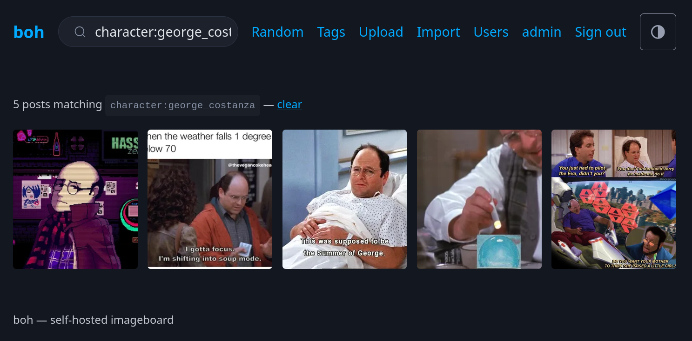

# boh

A self-hosted imageboard for one person or a few friends. Tag-based, deliberately small, and designed to run as a single container.

Think danbooru, minus everything needed to serve thousands of strangers. It should be simple enough for selfhosters to deploy. Contributions are welcome. That said, I want to keep this application relatively lightweight.



## Features

- Upload images and video; thumbnails generated automatically
- Namespaced tags (`artist:foo`, `meme:pondering_my_orb`, `rating:safe`) with autocomplete
- Tag search with exclusion (`landscape -rating:explicit`)
- Tag **aliases** — `scenery` can redirect to `landscape` everywhere
- Tag **implications** — `meme:pondering_my_orb` can automatically apply `format:reaction_image`
- Import from third-party sites via bundled [gallery-dl](https://github.com/mikf/gallery-dl), mapping site metadata onto tags
- Duplicate detection: the same file cannot be posted twice. Fuzzy search for similar images based on perceptual hashing.
- Thumbnails rebuildable from originals, so they can live on disposable storage
- Light/Dark mode. There are a few alternative themes as well.
- Optional public browsing with private writes
- Multi-user: ordinary accounts plus administrators who manage them
- **Passkeys** — sign in with a fingerprint, face unlock or a hardware key instead of a password
- REST [API](#api) with per-user tokens

## Quick start

```yaml
# docker-compose.yml
services:
  boh:
    image: ghcr.io/kylebavis/boh:latest
    ports:
      - "8080:8080"
    volumes:
      - boh_data:/data
    environment:
      BOH_ADMIN_PASSWORD: change-me
    restart: unless-stopped

volumes:
  boh_data:
```

```sh
docker compose up -d
```

Open <http://localhost:8080> and sign in as **`admin`** with the password you set.

All of the app's data lives under `/data` — database, originals, thumbnails. The app uses SQLite for its database, so you can (probably) get away with a filesystem backup instead of a full-featured database backup tool.

## Configuration

All settings are environment variables.

| Variable | Default | Meaning |
|---|---|---|
| `BOH_ADMIN_PASSWORD` | — | Password for the seeded `admin` account. Reapplied on every start, along with its administrator rights. |
| `BOH_AUTH_MODE` | `single` | `single` for password auth, `none` to disable auth entirely. |
| `BOH_PASSKEY_RP_ID` | the request's host | The domain passkeys are bound to. Only needed when the instance answers on several hostnames — see [Passkeys](#passkeys). |
| `BOH_PASSKEY_ORIGINS` | HTTPS origins of the request's domain | Comma-separated origins a passkey may be used from, scheme and port included. Set it alongside `BOH_PASSKEY_RP_ID`, or to allow a plain-HTTP origin for local development. |
| `BOH_PUBLIC_READ` | `false` | When `true`, anyone can browse and view; uploading, tagging, deleting and importing still require signing in. |
| `BOH_DATA_PATH` | `/data` | Base directory. Everything below defaults to a subdirectory of this. |
| `BOH_DB_PATH` | `{DATA}/boh.db` | SQLite database file. **Must be local storage** — see below. |
| `BOH_ORIGINALS_PATH` | `{DATA}/originals` | Full-size media. The bulk of the data; the usual candidate for a NAS. |
| `BOH_THUMBS_PATH` | `{DATA}/thumbs` | Generated thumbnails. Regenerable, but only by re-processing every original. |
| `BOH_KEYS_PATH` | `{DATA}/keys` | Data protection keys. Keep with the database. |
| `BOH_TEMP_PATH` | `{DATA}/tmp` | Scratch space for imports. |
| `BOH_MAX_UPLOAD_MB` | `256` | Largest accepted upload. |
| `BOH_PAGE_SIZE` | `40` | Posts per gallery page. |
| `BOH_THUMBNAIL_SIZE` | `400` | Longest thumbnail edge, in pixels. |
| `BOH_IMPORT_MAX` | `50` | Most files a single gallery-dl import may produce. |
| `BOH_IMPORT_TIMEOUT_SEC` | `300` | How long an import may run before it is stopped. |
| `ASPNETCORE_URLS` | `http://+:8080` | Listen address. |

### Storage layout

You may wish to store different types of files in different locations.

| What | Grows | Notes |
|---|---|---|
| Database | Slowly | Small, but written constantly. **Local disk only.** |
| Originals | Fast |  Written once, read occasionally. |
| Thumbnails | Meh | ~1–2% of originals. Local storage helps, but is not strictly necessary. |

> **Do not put the database on a network share.** See <https://sqlite.org/useovernet.html> for more information.

A split deployment — database and thumbnails on local disk, media on a NAS:

```yaml
services:
  boh:
    image: ghcr.io/kylebavis/boh:latest
    ports:
      - "8080:8080"
    volumes:
      - /var/lib/boh:/var/lib/boh          # database + keys, local disk
      - /mnt/nas/booru:/mnt/media          # originals, SMB mount
      - boh_thumbs:/var/cache/boh-thumbs   # thumbnails, local
    environment:
      BOH_ADMIN_PASSWORD: change-me
      BOH_DB_PATH: /var/lib/boh/boh.db
      BOH_KEYS_PATH: /var/lib/boh/keys
      BOH_TEMP_PATH: /var/lib/boh/tmp
      BOH_ORIGINALS_PATH: /mnt/media
      BOH_THUMBS_PATH: /var/cache/boh-thumbs
    restart: unless-stopped

volumes:
  boh_thumbs:
```

The container runs as **uid 1654**, and a new Docker volume or host directory is created owned by root, so the app cannot write to it. Prepare each location first:

```sh
sudo mkdir -p /var/lib/boh
sudo chown -R 1654:1654 /var/lib/boh
```

For an SMB mount, set the owner at mount time; for example, in `/etc/fstab`:

```
//nas/booru  /mnt/nas/booru  cifs  credentials=/etc/boh-smb,uid=1654,gid=1654,nofail  0  0
```

boh checks every configured location is writable before it starts, and names the offending path and the exact `chown` to run if not.

**Notes on splitting**

- Originals are content-addressed, so the tree can be moved between hosts or storage as-is — paths depend only on the file's SHA-256.
- Thumbnails are derived data and can be rebuilt from the originals — **Maintenance → Regenerate missing thumbnails**. Any non-trivial setup should probably put thumbnails persistent storage, but you can get away with not backing it up.
- As noted above, you can probably get away with a simple filesystem snapshot every so often, but, if you want something more configurable for the database, <https://github.com/nfrastack/container-db-backup> is useful for handling those backups.

### Users and roles

`BOH_ADMIN_PASSWORD` seeds an account called **`admin`**, which is always an administrator. From **Users** in the nav, an administrator can add accounts, reset passwords, promote and demote, and remove people. Anyone signed in can change their own password, and register or remove passkeys, from **Account**.

| | User | Administrator |
|---|---|---|
| Browse and search | ✓ | ✓ |
| Upload, tag, delete posts | ✓ | ✓ |
| Import from a URL | ✓ | ✓ |
| Change own password, manage own passkeys | ✓ | ✓ |
| Manage users | | ✓ |
| Aliases, implications, namespace colors | | ✓ |
| Maintenance (rebuild thumbnails and implied tags, hash for duplicates, delete unused tags) | | ✓ |

A few behaviors worth knowing:

- **The last administrator cannot be deleted or demoted**, and you cannot delete the account you are currently signed in with.
- **Deleting a user keeps their posts.** The uploader field is cleared; nothing in the collection is removed.
- **The seeded `admin` account is reapplied on every start** while `BOH_ADMIN_PASSWORD` is set. You can clear this variable after first startup to manage the admin account's creds in-app.
- `BOH_AUTH_MODE=none` removes accounts altogether; the app is anonymously-writable in this configuration.

### Passkeys

This app supports passkeys. I probably won't remove password auth entirely for usability reasons.

**Passkeys require HTTPS.** Browsers refuse passkeys outside a secure context. To develop against a local instance over HTTP, name it in `BOH_PASSKEY_ORIGINS` (`http://localhost:8080`). Don't do this on a real deployment (duh).

```yaml
environment:
  BOH_PASSKEY_RP_ID: example.com
  BOH_PASSKEY_ORIGINS: https://boh.example.com,https://boh.internal.example.com
```

`BOH_PASSKEY_RP_ID` has to be a domain the hostnames share — the registrable suffix, so `example.com` for `boh.example.com`.

### Security notes

- **boh speaks plain HTTP.** [Kestrel can do https by itself, technically])(https://learn.microsoft.com/en-us/aspnet/core/fundamentals/servers/kestrel/endpoints?view=aspnetcore-10.0). Most selfhosters terminate TLS at their reverse proxy, so I didn't include support for this approach.
- **Sign-in attempts are rate limited** to 10 per address every 5 minutes (based on `X-Forwarded-For`)
- **`BOH_AUTH_MODE=none` disables all authentication**, including delete and import
- **The import feature makes the server fetch a URL you give it.** It always requires signing in, even with `BOH_PUBLIC_READ=true`.
- boh is built for a handful of trusted users. Anyone with an account can delete things.

## Tag syntax

Tags are lowercase, space-separated, and optionally namespaced:

```
landscape                    a plain tag
artist:foo                   namespaced
meme:pondering_my_orb        "pondering my orb" — spaces become underscores
```

Search accepts the same syntax, with `-` to exclude:

```
landscape                             posts tagged landscape
meme:pondering_my_orb artist:foo      posts with both
landscape -rating:explicit            landscape, excluding explicit
```

Terms combine with AND. Names are normalized identically on write and on search, so `Artist:Foo` and `artist:foo` are the same tag.

### Searching by source

`url:` searches a post's source URLs instead of its tags, matching anywhere in the address:

```
url:twitter.com                       posts sourced from twitter
url:flickr.com -url:twitter.com       on flickr but not twitter
landscape url:twitter.com             combines with tags like any other term
url:none                              posts with no source recorded
-url:none                             posts that have one
```

A post with several sources matches on any of them. Matching ignores case, and the text is literal. Wildcards are not supported.

### Searching by appearance

`similar:` takes a post id and finds posts that *look* like it, whatever their tags:

```
similar:123                           post 123 and anything that looks like it
similar:123 -rating:explicit          combines with tags like any other term
-similar:123                          everything that does not look like it
```

The reference post is included in its own results, so the search puts it beside its look-alikes for comparison.

### Aliases and implications

Managed at **Tags → Tag administration**.

An **alias** redirects one tag to another. After aliasing `scenery` to `landscape`, tagging a post with `scenery` stores `landscape`, searching `scenery` finds `landscape` posts, and existing posts are migrated.

An **implication** adds a tag automatically. With `meme:pondering_my_orb` implying `format:reaction_image`, any post tagged with the meme also gains the format, transitively through chains. Implied tags are marked on the post and cannot be removed by hand. If you add a tag that would later also be implied, it is static.

### Moving a tag vs aliasing it

A **move** renames the tag in place, keeping its posts, aliases and implications. If the destination already exists the two are merged and the source tag is deleted — so typing the old name later creates a fresh, unrelated tag.

An **alias** leaves the old name in place as a permanent redirect, so it keeps resolving however often it is used.

## Duplicates and near-duplicates

Byte-for-byte identical imports/uploads are rejected. If you are using the importer, it will add an additional source URL if appropriate.

Perceptually-similar posts are shown at import/upload-time.

## Importing

The import tool uses gallery-dl. To import from sites needing credentials or to fiddle with its behavior in other ways, place a [gallery-dl configuration file](https://github.com/mikf/gallery-dl#configuration) at `/data/gallery-dl.conf`.

Imports will continue if you navigate away from the page after starting one.

## API

A simple REST API is exposed under `/api/v1`, for scripting etc. Create a token under **Account → API tokens** and send it as a header: `Authorization: Bearer <token>`. `BOH_PUBLIC_READ` opens the read endpoints to anonymous callers, and `BOH_AUTH_MODE=none` opens everything.

| Method | Path | |
|---|---|---|
| `GET` | `/posts?q=&page=` | Search, same syntax as the gallery |
| `GET` | `/posts/random?q=` | `{ "id": … }` |
| `GET` | `/posts/{id}` | Post with tags, sources and file URLs |
| `POST` | `/posts` | Multipart upload: `file`, optional `tags` (space separated) and `source`. `409` with `postId` if already stored |
| `DELETE` | `/posts/{id}` | |
| `POST` | `/posts/{id}/tags` | `{ "tags": [...] }` adds |
| `PUT` | `/posts/{id}/tags` | `{ "tags": [...] }` replaces the explicit tags |
| `POST` | `/posts/{id}/sources` | `{ "url": … }` |
| `DELETE` | `/posts/{id}/sources/{sourceId}` | |
| `GET` | `/tags?q=&limit=` | Autocomplete |
| `POST` | `/imports` | `{ "url": … }` queues a gallery-dl import; `202` with its status |
| `GET` | `/imports/{id}` | Import status and result |

```sh
curl -H "Authorization: Bearer $BOH_TOKEN" -F file=@cat.jpg -F "tags=cat rating:safe" https://boh.example/api/v1/posts
```

## Development

I suggest building in a container:

```sh
docker build -t boh:dev .
docker run --rm -p 8080:8080 -v boh_dev:/data -e BOH_ADMIN_PASSWORD=dev boh:dev
```

With a local .NET 10 SDK:

```sh
dotnet test boh.slnx
dotnet run --project src/Boh.Web
```

EF Core migrations, without needing the SDK installed:

```sh
./scripts/ef.sh migrations add SomeChange
```

Migrations are applied automatically at startup.

### Layout

```
src/Boh.Web/
  Data/          EF Core entities, context, migrations
  Services/      storage, media processing, tags, import, duplicates, accounts
  Security/      cookie identity, security headers, passkey configuration
  Media/         the perceptual hash itself (no dependencies)
  Tags/          tag normalization and search parsing (no dependencies)
  Pages/         Razor Pages
  Endpoints/     blob serving
tests/Boh.Tests/
```

### Internals

Razor Pages with [htmx](https://htmx.org) for the interactive parts and [Pico CSS](https://picocss.com) for styling.

`wwwroot/css/themes.css` is generated by `scripts/build-themes.py`, which adapts each upstream palette until every text pair it produces meets WCAG AA and refuses to emit anything if a check fails. The output is committed, so the script is only needed when adding or changing a scheme — it is not part of the build.

## License

MIT — see [LICENSE](LICENSE).

The container image bundles third-party software under its own terms, notably gallery-dl (GPL-2.0) and FFmpeg. See [NOTICE](NOTICE) for the full list.

